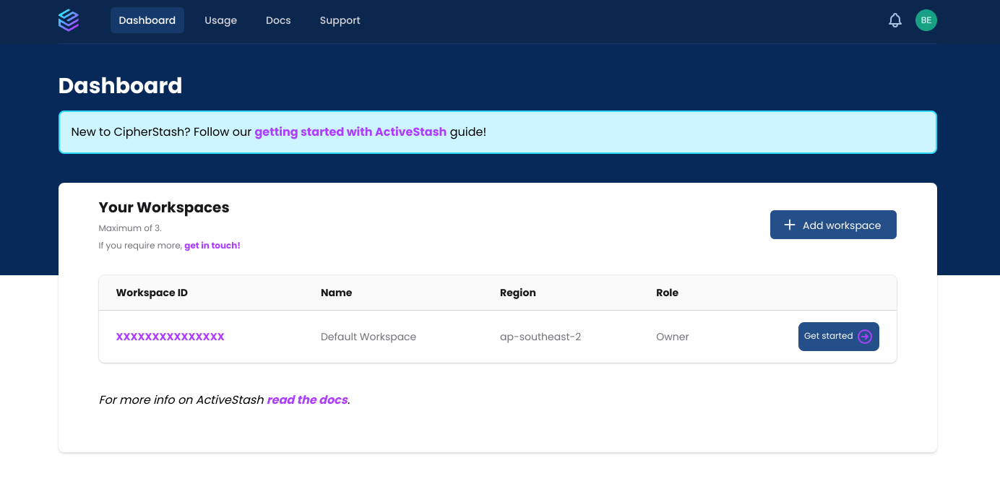

# StashJS

StashJS is a Typescript/Javascript API for the [CipherStash](https://cipherstash.com) always-encrypted searchable datastore.

Full documentation is available at [docs.cipherstash.com](https://docs.cipherstash.com/reference/stashjs/index.html) as a well as an [examples
repo](https://github.com/cipherstash/stashjs-examples).

## Getting Started

This tutorial will run you through installing the StashJS client library and writing a basic script to query a collection.

To complete this tutorial, you'll need a Linux or macOS computer (or virtual machine) on which you can install software.

The steps you'll go through are:

1. [Create a CipherStash Account](#creating-a-cipherstash-account)

1. [Install the CipherStash CLI](#installing-the-cipherstash-cli) on your local computer, to allow you to login to your workspace and start working with CipherStash.

1. [Create your first collection](#create-your-first-collection), so that your [records](https://docs.cipherstash.com/reference/glossary.html#record) have somewhere to live.

1. [Import some "test" records](#importing-records) into the collection.

1. [Query the imported records](#querying-records)

### Creating a CipherStash Account

In order to access CipherStash, you must first have an account.
This account grants you access both to the [CipherStash Console](https://console.cipherstash.com) web interface, as well as allowing you to access your [workspaces](https://docs.cipherstash.com/reference/glossary.html#workspace).

A CipherStash account is free, secure, and easy to create.

## Step 1: Visit the Console

To start creating a CipherStash account, simply point your web browser at https://console.cipherstash.com.

You will be redirected to the Console login page, which looks like this:


As you're a new user, you should click the "Sign up" link towards the bottom.
Alternately, you can use GitHub as your authentication provider by clicking the "Continue with GitHub" button and following the prompts.

## Step 2: Create Your Account

In order to create your account, we need to know:

1. Your E-mail Address; and

2. Your preferred password.

That's it. We don't need to know your full name, gender preference, or shoe size, so we don't ask for it.

## Step 3: View Your Workspace

As soon as you've created your account, you will be redirected to the Console home screen, which looks like this.



We've already created a workspace for you so there's nothing more you need to do.
For now, just make a note of the ID of your workspace, we'll use it later.

## Step 4: Verify Your E-mail Address

We _do_ want to make sure your e-mail address is correct, so we send a verification e-mail to the e-mail address you gave.
Please find the verification e-mail (it sometimes ends up in "Spam" or "Promotions", so check there too) and click the verification link.
You will get this helpful, friendly message when that succeeds:


### Installing the CipherStash CLI

The CipherStash CLI is the primary way you'll interact with CipherStash.
It allows you to login to a workspace, manage collections, and so on.

In order to install CipherStash CLI, you must have a Linux or macOS computer (or virtual machine) on which you can install software.
Windows is not _officially_ supported at this time, although you may have some success with WSL2.

#### Step 1: Install Dependencies

The CipherStash CLI requires these dependencies:

- [Node.js](https://nodejs.org/) version 16 or higher
- [OpenSSL](https://www.openssl.org/)
- [Rust](https://www.rust-lang.org/) compiler and build tools (at least 1.59, and [nightly](https://doc.rust-lang.org/book/appendix-07-nightly-rust.html) if [you are on ARM](https://docs.rs/aes/latest/aes/#armv8-intrinsics-nightly-only))

**⚠️ If you are confident installing these yourself, [you can skip ahead](#step-2-install-the-cipherstash-cli).**

<details>
<summary><h5>Installing Dependencies on macOS</h5></summary>

Installing the dependencies using [Homebrew](https://brew.sh/):

```bash
brew install openssl node@16 rust
```

If you are running macOS on Apple Silicon, you'll need to install the nightly version of Rust, [so cryptography works](https://docs.rs/aes/latest/aes/#armv8-intrinsics-nightly-only).

```bash
rustup default nightly
rustup update nightly
```

You will also need the Xcode command line tools which you can install by running:

```bash
xcode-select --install
```

###### Dependency: Configuring Node.js v16 on macOS

Once you have the Node.js v16 installed, you need to configure npm so CipherStash CLI dependencies using Rust can install correctly:

```bash
mkdir ~/.npm-global
npm config set prefix '~/.npm-global'
echo 'export PATH="~/.npm-global/bin:$PATH"' >> ~/.profile
source ~/.profile
```

</details>

<details>
<summary><h5>Installing Dependencies on Linux</h5></summary>

##### Installing Dependencies on Linux

Specific steps will depend on your distribution.

Installing the build dependencies is typically a matter of asking your package manager nicely.
For instance, on Fedora/Centos/Redhat:

```text
sudo dnf install openssl-devel gmp-devel curl make automake gcc
```

Meanwhile, over in Debian/Ubuntu land:

```text
sudo apt install build-essential curl libssl-dev
```

###### Dependency: Installing Node.js v16 on Linux

Installing Node.js is a slightly more involved proposition.
Most Linux distributions don't ship Node.js v16 or higher.
We recommend following [the official Node.js documentation](https://nodejs.org/en/download/package-manager/) to get Node.js v16 installed.

If you are running Ubuntu, you can run:

```bash
curl -fsSL https://deb.nodesource.com/setup_16.x | sudo -E bash -
sudo apt-get install -y nodejs
```

Once you have the Node.js v16 installed, you need to configure npm so CipherStash CLI dependencies using Rust can install correctly:

```bash
mkdir ~/.npm-global
npm config set prefix '~/.npm-global'
echo 'export PATH="~/.npm-global/bin:$PATH"' >> ~/.profile
source ~/.profile
```

###### Dependency: Installing Rust on Linux

Lastly, you'll need a Rust toolchain to build the cryptography inside the CipherStash CLI.

```bash
curl --proto '=https' --tlsv1.2 -sSf https://sh.rustup.rs | sh
source $HOME/.cargo/env
```

If you're running Linux on ARM, you'll need to use Rust nightly, [so cryptography works](https://docs.rs/aes/latest/aes/#armv8-intrinsics-nightly-only):

```bash
rustup default nightly
rustup update nightly
```

</details>

#### Step 2: Install the CipherStash CLI

We're on the home stretch now.
To install the CipherStash CLI, you can use the Node.js package manager, `npm`, to install the `stash` command:

```text
npm install -g @cipherstash/stash-cli
```

#### Step 3: Login to CipherStash

Exciting times, we're ready to get an access token and connect to CipherStash!

With the ID of the workspace that you found earlier in hand, run this command:

```text
stash login --workspace <workspaceID>
```

This command will prompt you to visit an authentication URL under `auth.cipherstash.com`.
You _might_ have to login again, if you haven't visited the Console in a while.
Once logged in, you should be presented with a page that looks like this:


Click the "Confirm" button to approve the creation of your access token.

### Create your First Collection

All [records](https://docs.cipherstash.com/reference/glossary.html#record) in CipherStash are stored in a [collection](https://docs.cipherstash.com/reference/glossary.html#collection).
You can think of a collection as loosely analogous to a table in a relational database, and records like rows.

For this tutorial, we're going to create a collection that stores information about movies.
Then we'll import a bunch of data, to give you something to search on.

#### Creating the Collection

Collections are created using the `stash create-collection` command from the CipherStash CLI.

The command expects a collection name as well as a [schema](https://docs.cipherstash.com/reference/glossary.html#schema) definition that describes the [indexes](https://docs.cipherstash.com/reference/glossary.html#index) and field types that are to be stored.

We've prepared some example data for your first collection. You can download its example schema from [here](https://cipherstash.com/examples/movies.schema.json), or by running the following command:

```text
curl -Lo movies.schema.json https://cipherstash.com/examples/movies.schema.json
```

With the file downloaded, let's use `movies.schema.json` to create a `movies` collection:

```text
stash create-collection movies --schema movies.schema.json
```

After a brief pause to talk to CipherStash, this command should return with the response "Collection 'movies' created.".
That means everything worked perfectly.

Of course, an empty collection is not very useful.
Thus, the next step is to [import some records](#importing-records).

Or, if you'd like to know more about collection schemas, read on.

#### Defining a Collection

A [collection](https://docs.cipherstash.com/reference/glossary.html#collection) in CipherStash is a named group of [records](https://docs.cipherstash.com/reference/glossary.html#record) that share a common purpose.
Typically, these records will all have the same (or similar) fields, and will be queried in the same way -- and therefore will have the same [indexes](https://docs.cipherstash.com/reference/glossary.html#index).
The description of record fields and indexes is defined when you create the collection, by means of a [schema](https://docs.cipherstash.com/reference/schema-definition.html).

CipherStash itself does not see any of this information -- the collection name, the fields and their types, and the index definitions are all encrypted before being sent to CipherStash to be stored.
Only clients that have access to the decryption key can see anything useful about the collection.

For the movies collection we created above, we'll define the types of the movie's title, year of release, and running time (in minutes).
Additional fields can be stored in the record, however the CipherStash client won't do any type checking on that data.

To facilitate searching for movies based on certain criteria, we'll also create the following indexes:

- **`exactTitle`**, so we can find a movie record if we know it's precise title (eg "find the movie named 'Star Trek II: The Wrath of Khan'");
- **`matchTitle`**, so we can lookup movies using partial string matches, when we can only remember part of a movie's title (eg "find all the movies with 'Star Trek' in their name);
- **`year`**, so we can find movies made in a given year, or movies made over a range of years (eg "find all the movies made between 1980 and 1989");
- **`runningTime`**, so we can find movies whose running time is in a certain range (eg "find me all movies that run for at least four hours").

CipherStash defines collection schemas using a [specially-structured JSON object](https://docs.cipherstash.com/reference/schema-definition.html), which describes the record fields (and their types), and the indexes.
For our collection of movies, with the fields and indexes listed above, the schema definition looks like this:

```javascript
{
  "type": {
    "title": "string",
    "year": "uint64",
    "runningTime": "uint64"
  },
  "indexes": {
    "exactTitle": { "kind": "exact", "field": "title" },
    "matchTitle": {
      "kind": "match",
      "fields": ["title"],
      "tokenFilters": [
        { "kind": "downcase" },
        { "kind": "ngram", "tokenLength": 3 }
      ],
      "tokenizer": { "kind": "standard" }
    },
    "runningTime": { "kind": "range", "field": "runningTime" },
    "year": { "kind": "range", "field": "year" }
  }
}
```

If you'd like to know all the gory details of what the above JSON means, the [CipherStash schema definition reference](https://docs.cipherstash.com/reference/schema-definition.html) will explain everything.

### Importing Records

Typically your application will store [records](https://docs.cipherstash.com/reference/glossary.html#record) in your [collections](https://docs.cipherstash.com/reference/glossary.html#collection) as they're created by your application.
For initial setup or migrations, though, it's often useful to be able to bulk-import existing data.
You can do this using the `stash import` command.

#### Import

Records to be imported should be saved as objects in a JSON array.
To get started, you can download some example movie data from [cipherstash.com/examples/movies.data.json](https://cipherstash.com/examples/movies.data.json).
Try running the following command to download `movies.data.json` so we can import it into CipherStash in the next step.

```text
curl -Lo movies.data.json https://cipherstash.com/examples/movies.data.json
```

After downloading, you should see that `movies.data.json` contains an array of objects that looks something like this:

```javascript
;[
  {
    title: "Star Trek: The Motion Picture",
    year: 1979,
    runningTime: 132,
  },
  {
    title: "Star Trek II: The Wrath of Khan",
    year: 1982,
    runningTime: 113,
  },
  {
    title: "Star Trek III: The Search for Spock",
    year: 1984,
    runningTime: 105,
  },
  // ... and so on
]
```

Now that we have some example data, let's pass it to `stash` for import:

```text
stash import movies --data movies.data.json
```

This will take a little while (and give your CPU some exercise), because the import process involves parsing and encrypting all the records as they get sent to CipherStash.
Once the command returns, your data is imported and ready to go.

### Querying Records

Having a [collection](https://docs.cipherstash.com/reference/glossary.html#collection) full of [records](https://docs.cipherstash.com/reference/glossary.html#record) isn't much use unless you can retrieve the data when you need it.
For this section of the tutorial, we'll introduce our "examples" codebase and look at some of those examples to show you how to perform queries against a collection.

#### The StashJS Examples

We've collected a bunch of common code snippets into [the StashJS examples git repository](https://github.com/cipherstash/stashjs-examples).
These provide examples of how to do most common operations with CipherStash, using [StashJS](https://npmjs.com/package/@cipherstash/stashjs), our TypeScript/JavaScript client library.
Most of these things you can also do using the [stash CLI](https://docs.cipherstash.com/reference/stash-cli/).

As querying is a complex operation, we've put several examples of how to do that in the `stashjs-examples` repo.
We'll download that repo, build the examples, and then run the querying examples so you can get a feel for how they work.

#### Downloading the stashjs-examples repo

The easiest way to get the `stashjs-examples` repo is to clone it using `git`:

```bash
git clone https://github.com/cipherstash/stashjs-examples
```

This shouldn't take very long, as the repository isn't very large.

From there, it should just be a matter of installing the dependencies, and then running the TypeScript compiler:

```bash
npm install
npm run build
```

#### Running the StashJS examples

All of the pure-JavaScript example code gets written into the `dist/` subdirectory, with a `.js` extension.
To run the simplest query example (an exact match on title), you can run the following command:

```bash
node dist/query-exact.js
```

This should output a single record from the `movies` [collection](https://docs.cipherstash.com/reference/glossary.html#collection), for the 2008 indie film "Lifelines" (originally titled "Wherever You Are").
All the other examples are run the same way, just change the filename.

#### Querying Fundamentals

If you examine the various querying examples (`query-exact.ts`, `query-range.ts`, `query-match.ts`, `query-count.ts`), you'll notice that most of the code is TypeScript boilerplate.
All that really changes in each script is the exact way that `movies.query()` is called.

In each case, the first argument is an inline function that describes the index and operator to apply to each record.
If that function returns a match, then the record will be included in the result.
For example:

```javascript
movies.query(movie => movie.exactTitle.eq("Lifelines"))
```

Since all querying in CipherStash is against an index, not against a record field, we need to specify the name of a previously-defined index (in this case, `exactTitle`) to query.
Valid operators depend on the index type.
The available index types, and what operators are valid for each type, are listed in [the reference documentation](https://docs.cipherstash.com/reference/index-types/).

For an [`exact`](https://docs.cipherstash.com/reference/index-types/exact.html) index, you can only use an `eq` ("exact equality") operator, and is typically used on boolean and string fields.
If you want to search for any string that matches another, you'll want the [`match`](https://docs.cipherstash.com/reference/index-types/match.html) index type.
Numeric types are best indexed with the [`range`](https://docs.cipherstash.com/reference/index-types/range.html) index type, which supports both equality and relational operators (such as less than, greater than, etc).

Examples of how to use each of these index types are provided in the examples repository.

In the snippet above, an array of matching records will be in the `documents` key of the object returned by `movies.query()`.

#### Ordering, Limits and Aggregates

The second argument to `stash.query()` allows you to specify keyword arguments that specify ordering, limits, and aggregation operations.
A simple example, to find the 10 oldest movies whose title matches the string "Life", looks like this:

```javascript
movies.query(movie => movie.title.match("Life"), {
  limit: 10,
  order: [{ byIndex: "year", direction: "ASC" }],
})
```

The `limit` option takes a positive integer which specifies the maximum number of records to return.
If you don't specify any ordering, any record(s) that match may end up being returned.

Sorting results is controlled by the `order` option, which takes a list of _ordering specifiers_.
These are simply objects containing `byIndex` and `direction` keywords.
As the name suggests, ordering in CipherStash is controlled by indexes; any `range` index can be used for sorting results, in either `"ASC"` (_ascending_, ie "smallest value first") or `"DESC"` (_descending_, ie "largest value first") order.

Aggregation -- the process of combining records together -- is specified with the `aggregation` option.
At present, the only available aggregation operation is `count`, and can be applied to any index like this:

```javascript
movies.query(movie => movie.title.match("Life"), {
  aggregation: [{ ofIndex: "runningTime", aggregate: "count" }],
})
```

Aggregation results are returned in the `aggregates` key of the object returned by `movies.query()`, like this:

```javascript
{
  documents: [...],
  aggregates: [
    { name: "count", value: 1234n }
  ]
}
```

Since when you're aggregating you often don't want the actual records themselves to be returned, you can specify the `skipResults: true` option, which will speed up the query and save sending back the record data that you won't care about anyway.

### Next steps

This is the end of our "Getting Started" tutorial.
It's time to start using CipherStash to build your first secured application.
If you'd like some help, we encourage you to sign up to [our public discussion forum](https://discuss.cipherstash.com) and post your questions.

## Usage Examples

### Create a collection

```ts
const movieSchema = JSON.parse(`
{
  "type": {
    "title": "string",
    "runningTime": "float64",
    "year": "float64"
  },
  "indexes": {
    "exactTitle": { "kind": "exact", "field": "title" },
    "runningTime": { "kind": "range", "field": "runningTime" },
    "year": { "kind": "range", "field": "year" },
    "title": {
      "kind": "match",
      "fields": ["title"],
      "tokenFilters": [
        { "kind": "downcase" },
        { "kind": "ngram", "tokenLength": 3 }
      ],
      "tokenizer": { "kind": "standard" }
    }
  }
}
`)
const stash = await Stash.connect()
const movies = await stash.createCollection(movieSchema)
```

### Inserting a record

```ts
const stash = await Stash.connect()
const movies = await stash.loadCollection(movieSchema)
console.log(`Collection "${movies.name}" loaded`)

let id = await movies.put({
  title: "The Matrix",
  year: 1999,
  runningTime: 136,
})
```

### Basic queries

```ts
let queryResult = await movies.query(movie => movie.exactTitle.eq("Lifelines"), { limit: 10 })
```

### Free text-search

```ts
let queryResult = await movies.query(movie => movie.title.match("star wa"), { limit: 10 })
```

### Range queries

```ts
let queryResult = await movies.query(movie => movie.year.lte(1940), {
  limit: 5,
  order: [{ byIndex: "year", direction: "DESC" }],
})
```

## Developing

StashJS is currently maintained in a private monorepo which is synced to [this repo](https://github.com/cipherstash/stashjs) when we push a new release to NPM.

We are in the process of moving StashJS (and its dependencies) out of our private monorepo and when that happens, [this repo](https://github.com/cipherstash/stashjs) will be where all development happens in the open.

### Tests

You may be wondering where all the tests are!

There are some unit tests in the StashJS repo but the bulk of the tests are are predominantly end-to-end tests against the CipherStash test infrastructure and they still live in our monorepo.

We have plans to move what tests we can to this repo and also convert some of those tests into unit tests that can be run by anyone hacking on this code.

We aren't there yet, but please be patient with us while we tease apart the necessary bits and bobs to make it happen.

## Future technical direction

The core encryption happens in a Rust package called [ore.rs](https://ore.rs).
More of StashJS will be converted from TypeScript to Rust code over time so that we can provide client bindings in as many languages as possible without rebuilding the world, and to ensure _correctness_ and _interoperability_.

All of the parts of StashJS that are converted to Rust will also be publicly released under a permissive open source license and developed in the open.
